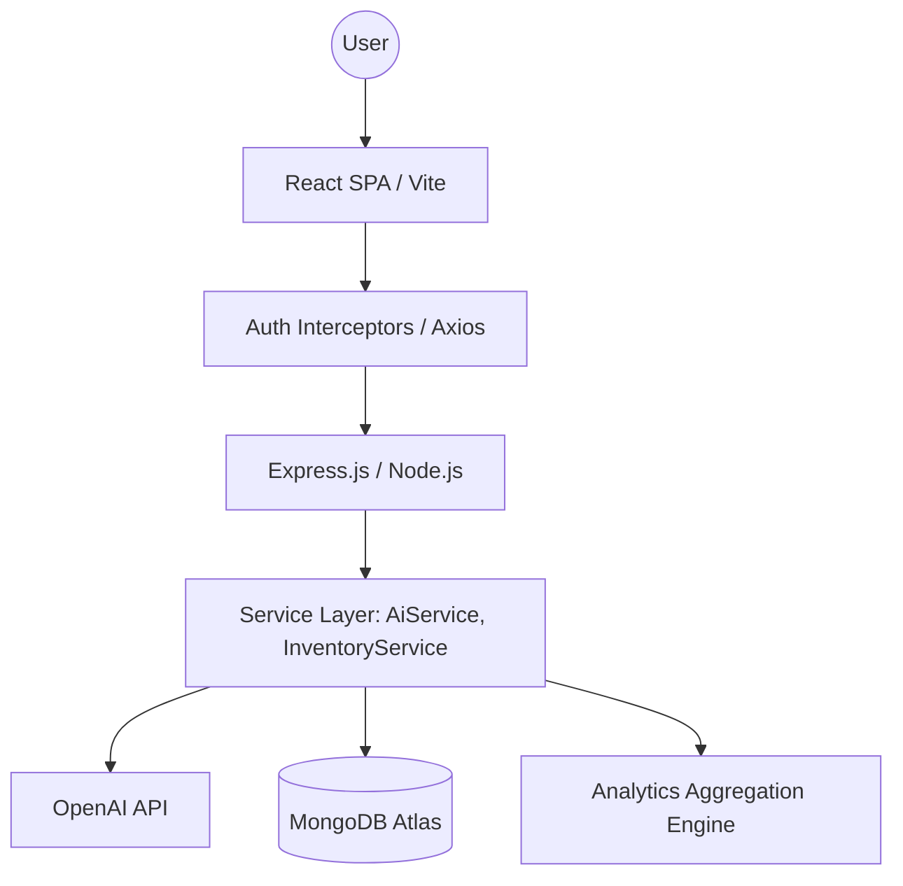

# VyaparFlow 🚀
### AI-Powered Business Management & Intelligent Invoicing SaaS Platform

[](https://reactjs.org/)
[](https://nodejs.org/)
[](https://www.mongodb.com/)
[](https://tailwindcss.com/)
[](https://openai.com/)
[](https://opensource.org/licenses/MIT)

**VyaparFlow** is a production-grade SaaS platform designed to transform raw business data into actionable intelligence. Beyond just generating invoices, it serves as a central "Command Center" for modern entrepreneurs, integrating AI-driven insights, real-time analytics, and automated inventory management into a premium, high-fidelity interface.

---

## 🌟 Core Modules

### 🧠 1. AI Business Intelligence Engine
Transforming generic AI into practical utility. Our contextual intelligence layer analyzes real business metrics to provide:
- **Predictive Recommendations**: Automated advice on inventory replenishment and cash flow management.
- **Smart Generation**: Interpret natural language service descriptions into structured invoice line items.
- **Risk Assessment**: Real-time monitoring of business health and outstanding credit risks.

### 📊 2. Real-Time Analytics & BI
High-fidelity data visualization using **Recharts**:
- **Revenue Velocity**: Track monthly growth and revenue trends with animated area charts.
- **Client Performance**: Identify top-tier customers via revenue distribution bar charts.
- **Predictive Forecasting**: AI-generated revenue projections based on historical performance.

### 🛡️ 3. Production-Grade Security & RBAC
Built for security-first enterprise usage:
- **Dual-Token Flow**: Secure session management using short-lived Access Tokens and long-lived Refresh Tokens.
- **RBAC**: Granular Role-Based Access Control (Admin, Staff, User).
- **Audit Logging**: Structured security auditing for all critical authentication and authorization events.

### 📦 4. Atomic Inventory Synchronization
Reliable stock management integrated directly into the transaction flow:
- **Automatic Stock Adjustments**: Inventory levels adjust in real-time as invoices are finalized.
- **Overselling Prevention**: Atomic validation ensures transactions only proceed if stock is sufficient.
- **Low-Stock Intelligence**: Automated alerts and AI predictions for inventory health.

---

## 🏗️ System Architecture



---

## 💻 Tech Stack

- **Frontend**: React 19, Tailwind CSS, Framer Motion, Recharts, TanStack Query
- **Backend**: Node.js, Express.js, JWT (Access/Refresh), bcryptjs
- **Database**: MongoDB Atlas (Mongoose ODM)
- **Intelligence**: OpenAI GPT-4o Integration
- **DevOps**: Vercel (Frontend), Render (Backend), GitHub Actions

---

## 📁 Project Structure

```text
vyaparflow/
├── backend/
│   ├── config/          # DB & Server configuration
│   ├── controllers/     # Controller layer (Express)
│   ├── middleware/      # Auth (RBAC), Error, & Security middleware
│   ├── models/          # Mongoose Schemas (User, Invoice, Product, Client)
│   ├── routes/          # API Route definitions
│   ├── services/        # Business Logic (AI, Inventory, Analytics)
│   └── utils/           # Shared utilities (Logger, AppError)
├── frontend/
│   ├── src/
│   │   ├── components/  # Reusable UI components
│   │   ├── hooks/       # Custom React Query & Business hooks
│   │   ├── pages/       # Dashboard, Analytics, Auth, Inventory
│   │   ├── ui/          # Standardized Design System components
│   │   └── api.js       # Standardized Axios Interceptor instance
└── README.md
```

---

## 🚀 Installation & Setup

### Prerequisites
- Node.js (v18+)
- MongoDB (Local or Atlas)
- OpenAI API Key

### 1. Clone & Install
```bash
git clone https://github.com/CrypticAarya/vyaparr-invoice-generator.git
cd vyaparr-invoice-generator
npm run install:all
```

### 2. Environment Configuration
Create a `.env` file in the `backend/` directory:
```env
MONGODB_URI=your_mongodb_uri
JWT_SECRET=your_secure_secret
REFRESH_SECRET=your_secure_refresh_secret
OPENAI_API_KEY=your_openai_key
FRONTEND_URL=http://localhost:5173
```

### 3. Run Development
```bash
npm run dev
```

---

## 🛣️ Future Roadmap

- [ ] **Automated Client Follow-ups**: AI-generated email reminders for overdue invoices.
- [ ] **Multi-Currency Support**: Dynamic tax and currency conversion for global trade.
- [ ] **Team Collaboration**: Shared workspaces with staff-level permissions.
- [ ] **Mobile Companion**: Dedicated iOS/Android app for on-the-go billing.

---

## 📄 License & Author

Distributed under the **MIT License**. Created with ❤️ by **Sarthak**.

---
*Developed as a world-class demonstration of modern SaaS architecture and AI integration.*
